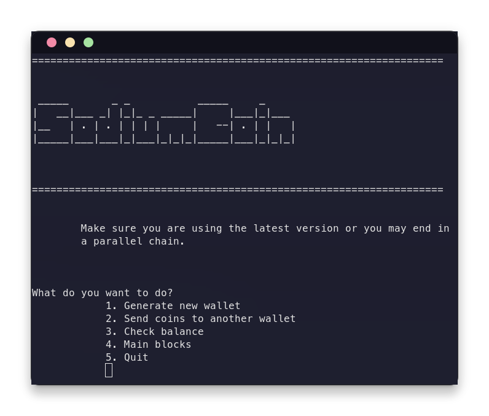
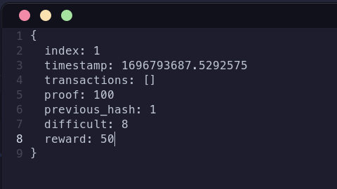
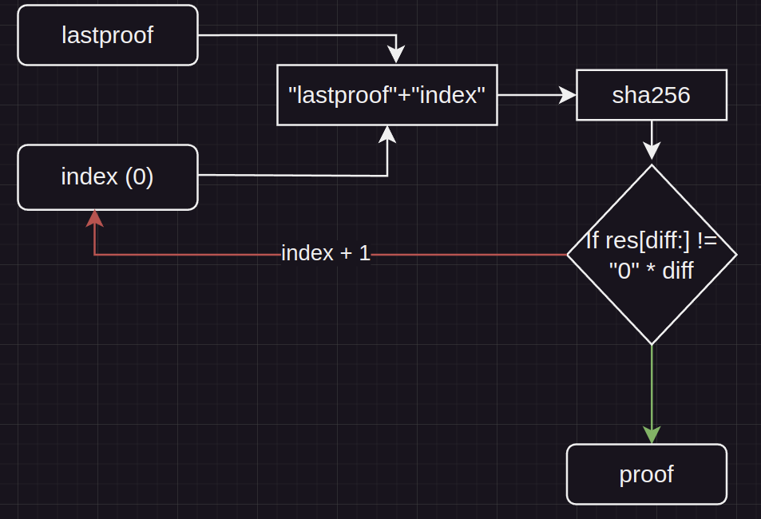
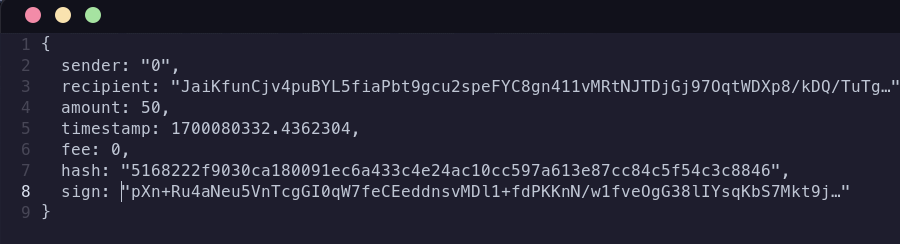

# SodiumCoin v1.0.0

## Это блокчейн проект написаный c помощью Python, FastAPI, Mongodb
Да, писать блокчейн клиент на python идея плохая и использовать серверную базу данных тоже, так как не удобно конечному
пользователю, но проект написан ради знаний и развлечения поэтому разницы нет 

# Как запустить
Нужен python версии 11

Создаем виртуальное окружение `python -m venv venv` и ставим зависимости из requirements.txt `pip install -r requirements.txt`, также нужно запустить mongodb сервер
Теперь в файле .env ставим свой приватный и публичный ключи и добавляем ноды.
Запускаем API `python main.py` теперь параллельно запускаем консольный клиент `python wallet.py`
И можем пользоваться

# Как работает (типо Whitepaper)

### Genesis Block выглядит вот так

Выбор времени, доказательства работы и предыдущего хэша ничем не обусловлено, сложность выбрана довольно малая, так как
не реализован майнинг на видеокарте, а для процессора достаточно и 8 нулей в начале

### О блоке

Индекс каждого нового блока увеличивается на 1 начиная с 1, в timestamp записывается текущее время создания блока, выступает
в роли удобного поля и не как не валидируется. Поле transactions содержит массив всех транзакций в блоке в том числе и эммисионную транзакцию
Она обяза быть в этом массиве иначе блок не считает валидным, так же как и если не валидна хоть одна транзакция из блока или/и в блоке есть идентичные транзакции.
Поле Proof содержит доказательство работы необходимое для потдержания консенсуса в сети и защиты от двойных трат
Вот как создается proof
  
Поле previous_hash это sha256 от прошлого блока,
Поле difficult текущее количество нулей в хэша,
Поле reward текущая награда за создания блока.

### Транзакции
Пример обычной транзакции
  
Поле sender содержит публичный адресс отправителя монет в транзакции для эмисионных транзакции отравитель будет "0",  
Поле recipient содержит уже публичный адресс получателя, и так как это поле не как не валидируется то получатель может не существовать и монеты могут выйти из оборота,  
Amount содержит количество отправяемых монет, минимальное деление для монеты 10^(-8)  
Timestamp выполняет такую же функцию как и в блоке, Fee это коммисия за транзакцию для майнеров, не может быть меньше минимального деления,  
Hash содержит sha256 хэш предыдуших полей в блоке, Поле Sign содержит подпись хэша блока в случае эмисии требуется подпись получателя, в случае обычной транзакции отправителя.  
Для создания ключей и подписей используется алгоритм ECDSA.SECP256k1

### О не сделаном
Не сделал нормальное p2p, не сделал майнинг с видеокарты и выбор транзакций по размеру коммисии, так же текущее состояние  
блокчейна хранится просто в словаре python и создаётся заново после каждой валидации цепи, нет халвинга и увеличения сложности что создает огромную потенциальную инфляцию
